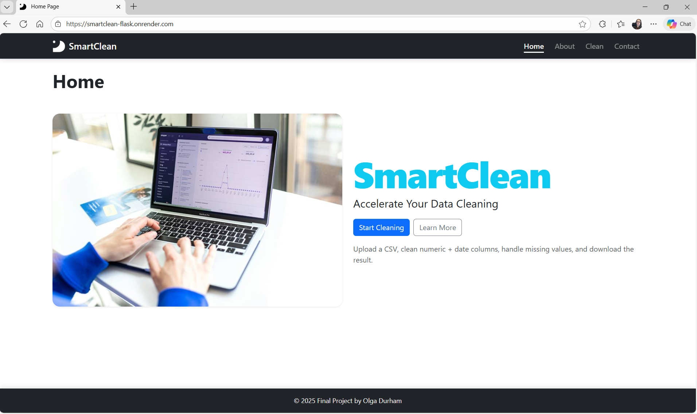
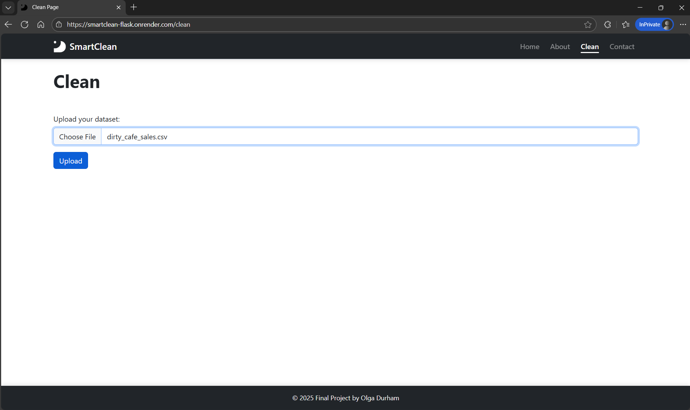
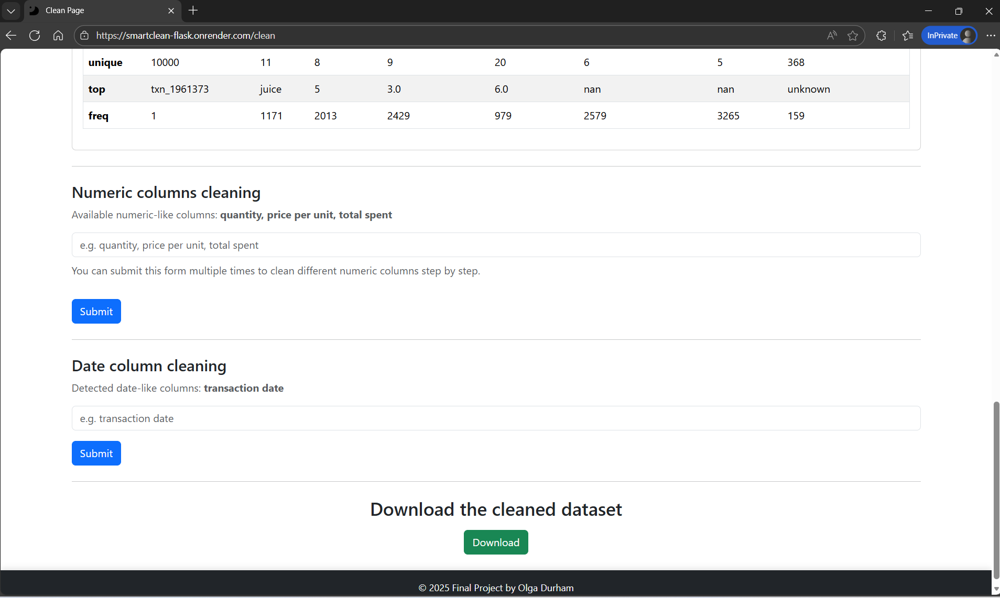
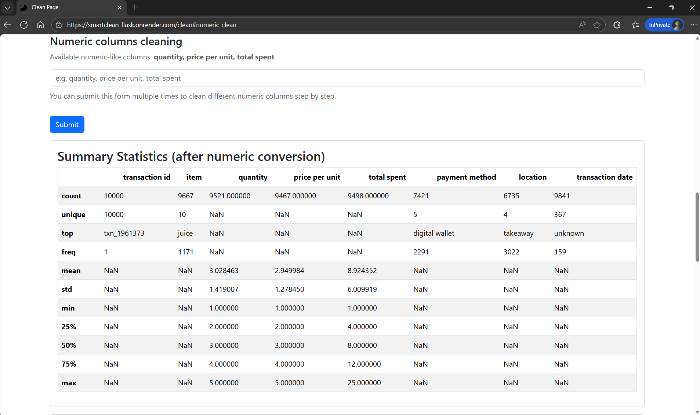
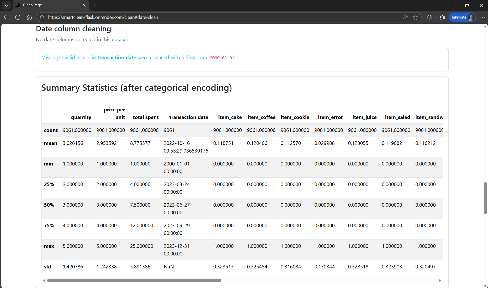
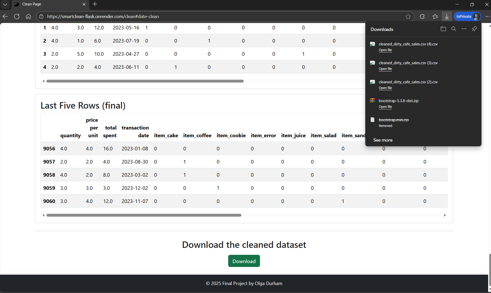

# 🧹 SmartClean – Dataset Cleaning Web Application

SmartClean is a Flask-based web application designed to **simplify and accelerate dataset cleaning**.  
It allows users to upload CSV files, clean numerical, categorical, and date data, and download a cleaned dataset — all through an intuitive web interface.

🔗 **Live demo:** https://smartclean-flask.onrender.com/

---

## ✨ Features

- 📁 Upload CSV datasets
- 🔢 Detect and clean numeric columns
- 📅 Detect and clean date columns
- 🧩 Handle categorical data with encoding
- ❌ Remove duplicate rows
- 🧼 Handle missing and invalid values
- 📊 View dataset summaries and statistics
- ⬇️ Download the cleaned dataset
- 📱 Fully responsive UI (Bootstrap 5)
- 🎨 Custom branding, favicon, and logo

---

## 📸 Screenshots

### 🏠 Home Page


### 📁 Upload Dataset


### 🔢 Numeric Columns Cleaning



### 📅 Date Cleaning & Encoding


### ⬇️ Download Cleaned Dataset


---

## 🛠️ Technologies Used

- **Backend:** Python, Flask
- **Frontend:** HTML, Jinja2, Bootstrap 5
- **Data Processing:** Pandas, NumPy
- **Deployment:** Render
- **Version Control:** Git & GitHub

---

## 📂 Project Structure

```
smartclean-flask/
│
├── app.py
├── requirements.txt
├── README.md
│
├── templates/
│ ├── base.html
│ ├── index.html
│ ├── about.html
│ ├── contact.html
│ └── clean.html
│
├── static/
│ ├── style.css
│ ├── images/
│ ├── logos/
│ └── vendor/
│ └── bootstrap/
│
└── uploads/
```


---

## 🚀 How It Works

1. Upload a CSV file
2. Review dataset info (duplicates, missing values, column types)
3. Select numeric columns to clean
4. Select date columns to normalize
5. Automatically encode categorical data
6. Download the cleaned dataset

---

### Dataset Persistence

SmartClean keeps the uploaded dataset active during the user session to support multi-step cleaning workflows (numeric, categorical, and date cleaning).

Refreshing the page does not remove the current dataset.  
To start over, simply upload a new dataset using the **Upload New Dataset** button.

---

## 📦 Installation (Local Setup)

```bash
git clone https://github.com/your-username/smartclean-flask.git
cd smartclean-flask
python -m venv venv
source venv/bin/activate  # Windows: venv\Scripts\activate
pip install -r requirements.txt
python app.py
```


Then open:

http://127.0.0.1:5000

🌐 Deployment

The application is deployed on Render and runs successfully in production:

🔗 https://smartclean-flask.onrender.com/

👩‍💻 Author

Olga Durham
Final Project – Web Development IV
Algonquin College

📧 shap0011@algonquinlive.com

📌 Notes

SmartClean is designed for educational and portfolio purposes

Supports small to medium-sized datasets

No data is stored permanently on the server

🏁 License

This project is for academic use and demonstration purposes.


